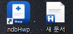
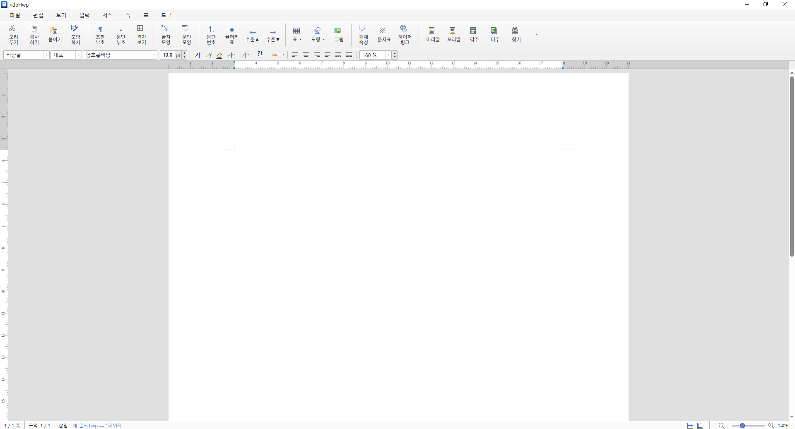

# ndbHwp

**ndbHwp is Open HWP**

ndbHwp는 HWP/HWPX 문서를 보고 편집할 수 있는 오픈소스 Windows용 데스크탑 앱입니다.

문서 파싱과 렌더링의 기반은 [rhwp](https://github.com/edwardkim/rhwp)를 사용합니다. ndbHwp는 그 위에 얇게 껍데기를 씌운 앱입니다. rhwp가 제공하는 기능을 바탕으로 파일 열기, 저장, PDF 내보내기, 인쇄, 파일 연결 같은 OS 통합 기능을 제공합니다.

## 할 수 있는 일

현재 ndbHwp는 다음 흐름을 지원합니다.

* HWP/HWPX 문서 열기
* HWP 문서 저장, 다른 이름으로 저장
* PDF로 내보내기
* 인쇄 다이얼로그 열기
* 파일 드래그 앤 드롭으로 열기
* `.hwp`, `.hwpx` 파일 연결
* 여러 창에서 문서 열기

## 다운로드

설치 유형은 setup 파일로 전산팀에서 관리하고 있으며 필요시 설치를 진행을 도와드리고 있습니다.

## 개발하기

개발 환경 준비, 실행 명령, 프로젝트 구조, `rhwp`와의 관계는 [개발 문서](docs/DEVELOPMENT.md)에 정리해 두었습니다.

## Credits

ndbHwp는 [rhwp](https://github.com/edwardkim/rhwp)를 기반으로 합니다. HWP 엔진을 공개해 주신 개발자분께 감사드립니다.

License: MIT
